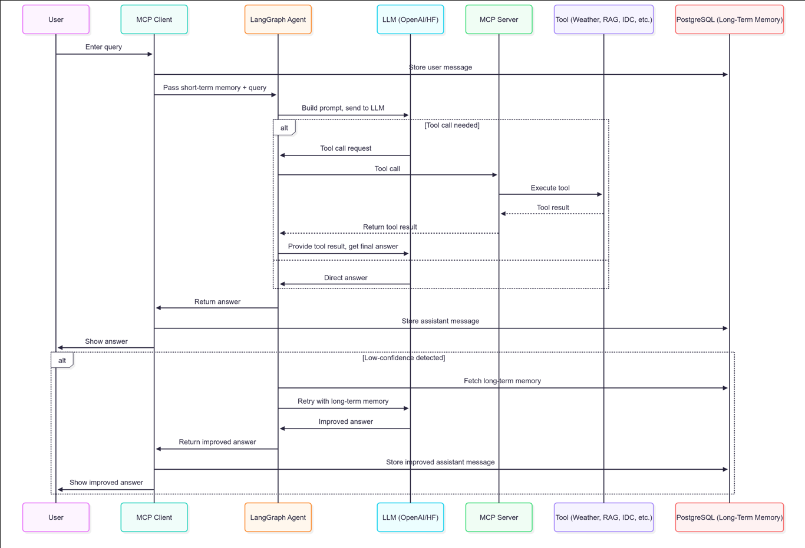

<!--
Author: Gopesh Khandelwal
Email: gopesh.khandelwal@intel.com
-->

# ITAC AI Agent (An end-to-end GenAI framework)

## Overview

The ITAC AI Agent is a modular, production-ready framework that integrates Large Language Models (LLMs) with Intel tiber developer cloud (ITAC) and MCP (Model Context Protocol) to enable intelligent agentic behavior. It combines LangGraph-based orchestration, LangChain tool-calling, and advanced RAG-powered memory with secure, auditable tool execution. The system supports natural language queries that trigger real cloud actions—backed by open-source LLMs (e.g., LLaMA, Mistral) or OpenAI-compatible APIs—and demonstrates scalable, secure integration of advanced GenAI components across infrastructure.

## Architecture

### Sequence Diagram


## Features

- **LLM-powered agent**: Supports both OpenAI GPT models (via API) and local Hugging Face models (Llama, Mistral, etc.).
- **LangGraph orchestration**: Multi-tool, multi-step agent workflow using LangGraph for robust, extensible logic.
- **Advanced RAG (Retrieval-Augmented Generation)**: 
  - Hybrid search combining BM25 keyword and semantic vector search
  - Optional cross-encoder reranking for enhanced accuracy
  - Adaptive document retrieval based on query complexity
  - Query caching for improved performance
  - Multiple search strategies (hybrid, semantic, keyword)
- **Conversation Memory**: Short-Term and Long-Term (PostgreSQL).
- **Secure tool execution**: All tool calls are routed through the MCP server, with authentication and logging.
- **Extensible tool registry**: Easily add new tools for cloud, infrastructure, or document Q&A.
- **Async and streaming support**: Fast, scalable, and ready for production workloads.
- **Environment-based configuration**: Uses `.env` for secrets and endpoints.
- **Local model caching**: Avoids repeated downloads by using a local Hugging Face cache.

## Quickstart

1. **Clone the repository**
    ```sh
    git clone <repo-url>
    cd nextgen-ai
    ```

2. **Set up environment and install dependencies**
    ```sh
    make install
    ```

3. **Configure environment variables**
    - Copy `.env.example` to `.env` and fill in your secrets (OpenAI API key, Hugging Face token, ITAC tokens, etc).
    - Ensure your `.env` file contains the required database configuration:
    ```properties
    DB_NAME=your_db_name
    DB_USER=your_db_user
    DB_PASS=your_db_password
    DB_HOST=localhost
    DB_PORT=5432
    ```

4. **Install & Setup PostgreSQL**
    ```sh
    make setup-postgres
    ```
    
    This automated setup will:
    - Install PostgreSQL server and client tools
    - Start and enable the PostgreSQL service
    - Create the database and user from your `.env` configuration
    - Set up proper permissions and privileges
    - Configure authentication for password-based access
    - Create the required database tables (`conversation_history`)

5. **Download embedding models**
    ```sh
    # Download MiniLM embedding model (required for RAG)
    make download-model-minilm
    ```

6. **Build the vectorstore for document Q&A**
    ```sh
    # Place your docs in docs/ and set RAG_DOC_PATH in .env
    make build-vectorstore
    ```

7. **Build and run the vLLM Hermes server for local LLM inference**
    ```sh
    # Build and start the vLLM Hermes Docker image (downloads the model and vllm-fork automatically; runs on port 8000 by default)
    make setup-vllm-hermes

    # Check the logs or health endpoint to verify the server is running
    make logs-vllm-hermes
    ```

8. **Start the application**
    ```sh
    make start-nextgen-suite
    ```

9. **Interact with the system**
    Enter natural language queries such as:
    - "List of all available ITAC products"
    - "What is the weather in Dallas?"
    - "Give me a detailed explanation of ITAC gRPC APIs"
    
    The agent will automatically select and call the appropriate tools, returning results with source attribution.

## Advanced RAG Features

The system includes a production-ready RAG implementation with:

### **Hybrid Search**
- **BM25 keyword search**: Exact term matching
- **Semantic vector search**: Meaning-based retrieval
- **Ensemble combination**: Configurable weights (default: 70% semantic, 30% keyword)

### **Optional Reranking**
- **Cross-encoder reranking**: Enhanced relevance scoring using `sentence-transformers`
- **Automatic trigger**: Detects queries with "detailed", "comprehensive", "thorough" keywords
- **Configurable**: Enable/disable via `RAG_ENABLE_RERANKER` environment variable

### **Adaptive Retrieval**
- **Query complexity analysis**: Adjusts document count based on query length
- **Smart K selection**: Simple queries use fewer docs, complex queries use more
- **Performance optimization**: Caches results for repeated queries

```

## Adding New Tools

1. Implement your tool in `mcp_server/tools/`.
2. Register it in the `register_tools` function in `mcp_server/server.py`.
3. Restart the server to pick up new tools.
4. (Optional) Update the LangGraph agent logic if you want custom routing or multi-tool workflows.

## Environment Variables

See `.env.example` for all required and optional variables, including:

### **Core Configuration**
- `OPENAI_API_KEY`, `OPENAI_API_BASE`, `OPENAI_MODEL` (for OpenAI API)
- `HUGGINGFACE_HUB_TOKEN` (for model downloads)

### **RAG Configuration**
- `RAG_EMBED_MODEL` (local model path, e.g., `./resources/models/minilm`)
- `RAG_DOC_PATH`, `RAG_INDEX_DIR` (for RAG document processing)
- `RAG_SEMANTIC_WEIGHT=0.7` (semantic search weight)
- `RAG_KEYWORD_WEIGHT=0.3` (keyword search weight)
- `RAG_RETRIEVAL_K=5` (default number of documents to retrieve)
- `RAG_CACHE_SIZE=100` (query cache size)

### **Reranking Configuration**
- `RAG_ENABLE_RERANKER=true` (enable/disable reranking)
- `RAG_RERANKER_MODEL=cross-encoder/ms-marco-MiniLM-L-12-v2` (reranker model)
- `RAG_RERANK_CANDIDATE_MULTIPLIER=3` (candidate multiplier for reranking)

### **ITAC Integration**
- `ITAC_PRODUCTS` 

### **Database Configuration**
- `DB_HOST`, `DB_PORT`, `DB_NAME`, `DB_USER`, `DB_PASSWORD`

## Available Make Commands

```sh
# Environment setup
make install                    # Set up virtual environment and install dependencies
make install-postgres-deps      # Install PostgreSQL Python dependencies

# Database setup
make setup-postgres             # Complete PostgreSQL installation and configuration

# Model management
make download-model-minilm      # Download MiniLM embedding model for RAG
make download-model-llama-2-7b-chat-hf  # Download LLaMA 2 model for local inference

# RAG system
make build-vectorstore          # Build FAISS vectorstore from documents
make test-rag                   # Test RAG pipeline functionality

# Application
make start-nextgen-suite        # Start both MCP client and server
make clean                      # Clean up environment and artifacts
```

## Production Notes

- **Never commit real secrets to `.env` or git.**
- Use `make` commands for all workflows to ensure proper environment setup.
- All Python scripts use the `.venv` and correct `PYTHONPATH` for imports.
- Logging is enabled for all major actions and errors.
- For production, set environment variables securely (e.g., Docker secrets, Kubernetes secrets).
- Monitor logs for errors and tool execution.

### **RAG Performance Tuning**
- **Cache size**: Adjust `RAG_CACHE_SIZE` based on memory constraints
- **Search weights**: Tune `RAG_SEMANTIC_WEIGHT` and `RAG_KEYWORD_WEIGHT` for your use case
- **Reranking**: Enable for better quality, disable for faster responses
- **K values**: Adjust `RAG_RETRIEVAL_K` based on document corpus size

## Testing

### **RAG System Testing**
```sh
# Test RAG pipeline with sample queries
make test-rag
```

### **Manual Testing**
```sh
# Start the system
make start-nextgen-suite

# Test different query types:
# 1. Simple factual: "What is USA Capital?"
# 2. Complex technical: "Give info on ITAC gRPC API"
# 3. Detailed request: "List of all available ITAC products"
```

## Complete Setup Example

For a complete setup from scratch:

```sh
# Clone and setup
git clone <repo-url>
cd nextgen-ai

# Configure environment variables
cp .env.example .env
# Edit .env file with your actual values:
# - Set OpenAI API key, Hugging Face token, ITAC tokens
# - Configure database settings (DB_NAME, DB_USER, DB_PASS, etc.)
# - Set RAG and other configuration parameters

# Install everything
make install
make setup-postgres
make download-model-minilm
make build-vectorstore

# Start the application
make start-nextgen-suite
```

## Troubleshooting

### **Common Issues**
- **Failed to retrieve ITAC products**: Ensure your tool is not using Proxy.
  ```sh
  export NO_PROXY=
  export no_proxy=
  ```

- **ModuleNotFoundError**: Ensure you are running from the project root and using `make` targets.

- **Model not found**: Check `RAG_EMBED_MODEL` and Hugging Face token.

- **Vectorstore errors**: Ensure you have built the vectorstore and set `RAG_INDEX_DIR` correctly.

- **Rate limits**: Use a Hugging Face token and cache models locally.

- **Tool not called**: Ensure your tool is registered and appears in the agent's tool list.

### **RAG-Specific Issues**
- **Poor search quality**: Try enabling reranking with `RAG_ENABLE_RERANKER=true`
- **Slow responses**: Disable reranking or reduce `RAG_RETRIEVAL_K`
- **Memory issues**: Reduce `RAG_CACHE_SIZE` or use smaller embedding models
- **Reranking errors**: Ensure `sentence-transformers` is installed: `pip install sentence-transformers`

### **PostgreSQL Issues**
- **Peer authentication failed**: If you get "FATAL: Peer authentication failed for user", run:
  ```sh
  make setup-postgres  # This will reconfigure authentication
  ```
  Or manually connect using:
  ```sh
  psql -U demo_user -d demo_db -h localhost  # Forces TCP connection with password auth
  ```
- **Connection refused**: Ensure PostgreSQL is running: `sudo systemctl status postgresql`
- **Database does not exist**: Re-run `make setup-postgres` to recreate the database

## PostgreSQL Setup for Long-Term Memory

This project uses PostgreSQL to persist all conversation history for long-term memory.

### **Automated Setup (Recommended)**
The simplest way to set up PostgreSQL is using the provided Makefile target:

```sh
# One-command PostgreSQL setup
make setup-postgres
```

This automated setup will:
- Install PostgreSQL server and client tools
- Start and enable PostgreSQL service
- Create database and user from your `.env` configuration
- Set proper permissions and privileges
- Configure password-based authentication
- Create all required database tables automatically
- Handle error cases (existing database/user)

### **Manual Setup (Alternative)**
If you prefer manual setup:

1. **Install PostgreSQL** on your system.
2. **Create a database and user** (e.g., `demo_db` and `demo_user`).
3. **Create the required tables** using the schema in `common_utils/database/conversation_history.sql`:
   ```sh
   psql -U demo_user -d demo_db -f common_utils/database/conversation_history.sql
   ```
4. **Set your database credentials** in the `.env` file.
5. **Restart the application** to enable persistent conversation memory.

### **Configuration**
Ensure your `.env` file contains the database configuration:
```properties
DB_NAME=demo_db
DB_USER=demo_user
DB_PASS=DiwaliPwd123$
DB_HOST=localhost
DB_PORT=5432
```

All user and assistant messages will be stored in PostgreSQL, enabling robust long-term memory and analytics.

## System Architecture Details

### **RAG Pipeline Flow**
1. **Document Ingestion**: Documents are processed and stored in FAISS vectorstore
2. **Query Processing**: User queries are analyzed for complexity and intent
3. **Hybrid Retrieval**: BM25 and semantic search run in parallel
4. **Optional Reranking**: Cross-encoder reranks results for better relevance
5. **Answer Generation**: LLM generates response using retrieved context
6. **Source Attribution**: System provides transparency about sources used

### **Agent Workflow**
1. **Query Reception**: User input received via LangGraph agent
2. **Tool Selection**: Agent selects appropriate tool based on query content
3. **Tool Execution**: Selected tool executes via MCP protocol
4. **Response Assembly**: Results are formatted and returned to user
5. **Memory Storage**: Conversation history saved to PostgreSQL

---

**For more details, see comments in each script and `.env.example`.**

---

**Security Reminder:**  
Never commit real secrets or tokens. Use secure methods to handle sensitive information in production environments.

## License
See the [LICENSE](./LICENSE) file for full details.
## Test commit
